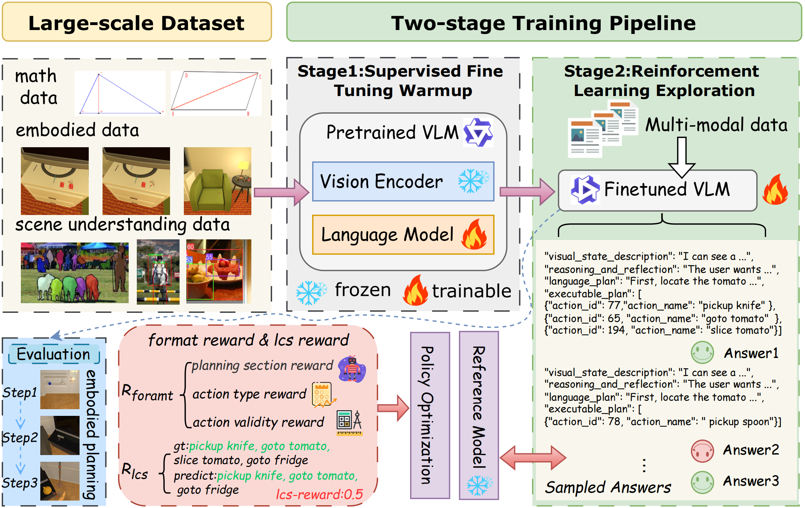

# RoboGPT-R1: Enhancing Robot Planning with Reinforcement Learning

  
  <!-- Hugging Face 徽章，准备好后把 href 和文字改掉 -->
  <a href="https://huggingface.co/<your-org>/<your-repo>" style="margin-left:8px;">
    
  </a>

## Overviwe

## Training
> Coming Soon...
## Model
> Coming Soon...
## Dataset
> Coming Soon...
